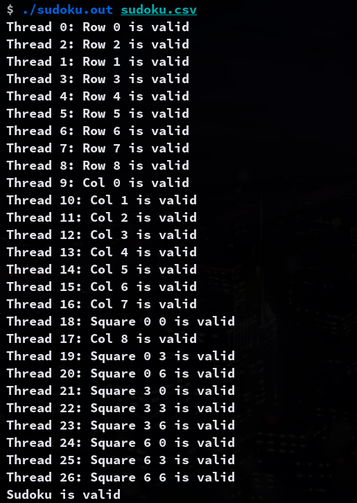
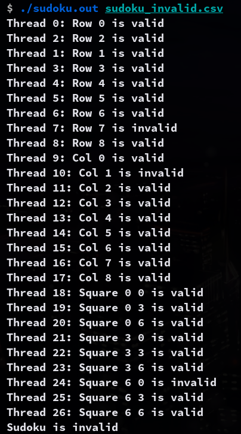

## Project 1

---

A Sudoku puzzle uses a 9 × 9 grid in which each column and row, as well as each of the nine 3 × 3 subgrids, must contain all of the digits 1 ⋅ ⋅ ⋅ 9. Figure 4.26 presents an example of a valid Sudoku puzzle. This project consists of designing a multithreaded application that determines whether the solution to a Sudoku puzzle is valid

### Compile

```sh
gcc -o sudoku.out sudoku.c -lpthread
```

### Usage

```sh
./sudoku.out <sudoku_file>
```

### Example Output

```sh
$ ./sudoku.out sudoku.txt
Thread 0: Row 0 is valid
Thread 1: Row 1 is valid
Thread 3: Row 3 is valid
Thread 2: Row 2 is valid
Thread 4: Row 4 is valid
Thread 5: Row 5 is valid
Thread 6: Row 6 is valid
Thread 7: Row 7 is valid
Thread 8: Row 8 is valid
Thread 9: Col 0 is valid
Thread 10: Col 1 is valid
Thread 11: Col 2 is valid
Thread 12: Col 3 is valid
Thread 13: Col 4 is valid
Thread 14: Col 5 is valid
Thread 15: Col 6 is valid
Thread 16: Col 7 is valid
Thread 17: Col 8 is valid
Thread 18: Square 0 0 is valid
Thread 19: Square 0 3 is valid
Thread 20: Square 0 6 is valid
Thread 21: Square 3 0 is valid
Thread 22: Square 3 3 is valid
Thread 23: Square 3 6 is valid
Thread 24: Square 6 0 is valid
Thread 25: Square 6 3 is valid
Thread 26: Square 6 6 is valid
Sudoku is valid
```


| valid | invalid |
| --- | --- |
|  |  |