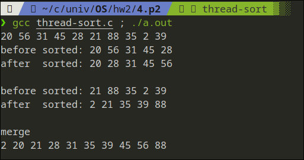

## CH4 Project2

### Project 2. Multithreaded sorting application
Write a multithreaded sorting program that works as
follows: A list of integers is divided into two smaller
lists of equal size. Two separate threads sort each
sublist using a sorting algorithm of your choice. The
two sublists are then merged by a third thread

---

#### exec

```sh
gcc thread-sort.c; ./a.out
```

#### screenshot

