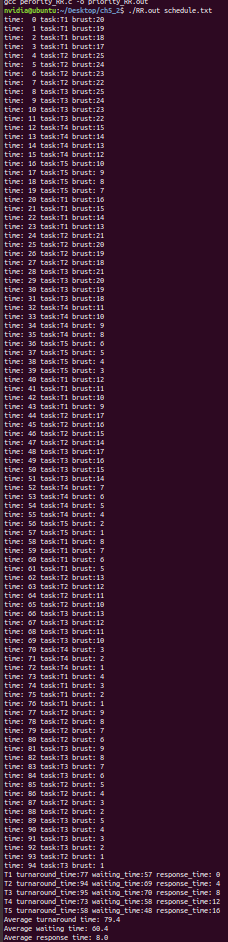
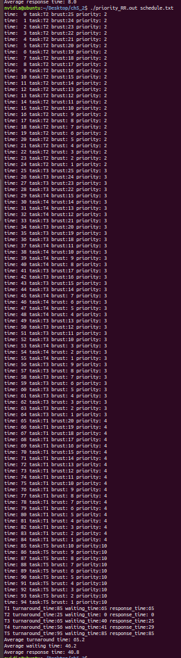

# ch 5

## run

```bash
make

./FCFS.out schedule.txt
./SJF.out schedule.txt
./priority.out schedule.txt
./RR.out schedule.txt
./priority_RR.out schedule.txt
```

## screenshot

| FCFS                               | SJF                                | priority                           |
| ---------------------------------- | ---------------------------------- | ---------------------------------- |
|  |  |  |

| RR (quantum = 4)               | priority_RR (quantum = 4)               |
| ------------------------------ | --------------------------------------- |
|  |  |
