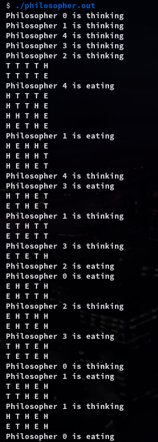

# 7.p3 The Dining-Philosophers Problem

This project involves implementing a solution to this problem using either POSIX mutex locks and condition variables.

Both implementations will require creating five philosophers, each identi-fied by a number 0 . . 4. Each philosopher will run as a separate thread. Philosophers alternate between thinking and eating. To simulate both activities, have each thread sleep for a random period between one and three seconds.

### Compile

```sh
gcc -o philosopher.out philosopher.c -lpthread
```

### Usage

```sh
./philosopher.out
```

### Example Output

```sh
$ ./philosopher.out
Philosopher 0 is thinking
Philosopher 1 is thinking
Philosopher 4 is thinking
Philosopher 3 is thinking
Philosopher 2 is thinking
T T T T H 
T T T T E 
Philosopher 4 is eating
H T T T E 
H T T H E 
H H T H E 
H E T H E 
Philosopher 1 is eating
H E H H E 
H E H H T 
H E H E T 
Philosopher 4 is thinking
Philosopher 3 is eating
H T H E T 
E T H E T 
Philosopher 1 is thinking
E T H T T 
E T E T T 
Philosopher 3 is thinking
E T E T H 
Philosopher 2 is eating
Philosopher 0 is eating
E H E T H 
E H T T H 
Philosopher 2 is thinking
E H T H H 
E H T E H 
Philosopher 3 is eating
T H T E H 
T E T E H 
Philosopher 0 is thinking
Philosopher 1 is eating
T E H E H 
T T H E H 
Philosopher 1 is thinking
H T H E H 
E T H E H 
Philosopher 0 is eating
```

