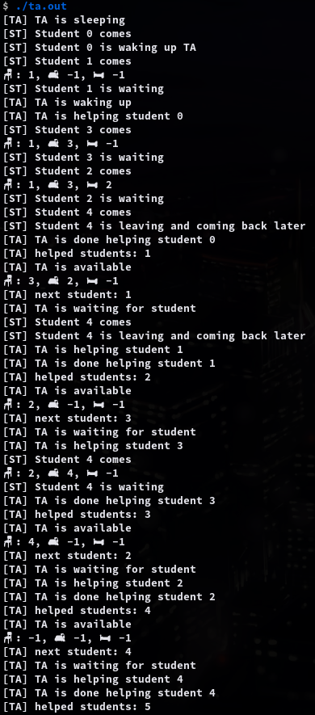

# 7.p2 The Sleeping Teaching Assistant

A university computer science department has a teaching assistant ( TA) who helps undergraduate students with their programming ssignments during regular office hours. The TA’s office is rather small and has room for only one desk with a chair and computer. There are three chairs in the hallway outside the office where students can sit and wait if the TA is currently helping another student. When there are no students who need help during office hours, the TA sits at the desk and takes a nap. If a student arrives during office hours and finds the TA sleeping, the student must awaken the TA to ask for help. If a student arrives and finds the TA currently helping another student, the student sits on one of the chairs in the hallway and waits. If no chairs are available, the student will come back at a later time. 
Using POSIX threads, mutex locks, and semaphores, implement a solution that coordinates the activities of the TA and the students. 

## Compile

```sh
gcc -o ta.out ta.c -lpthread
```

## Usage

```sh
./ta.out
```

## Example Output

```sh
$ ./ta.out 
$ ./ta.out
[TA] TA is sleeping
[ST] Student 0 comes
[ST] Student 0 is waking up TA
[ST] Student 1 comes
🪑: 1, 🛋️: -1, 🛏️: -1
[ST] Student 1 is waiting
[TA] TA is waking up
[TA] TA is helping student 0
[ST] Student 3 comes
🪑: 1, 🛋️: 3, 🛏️: -1
[ST] Student 3 is waiting
[ST] Student 2 comes
🪑: 1, 🛋️: 3, 🛏️: 2
[ST] Student 2 is waiting
[ST] Student 4 comes
[ST] Student 4 is leaving and coming back later
[TA] TA is done helping student 0
[TA] helped students: 1
[TA] TA is available
🪑: 3, 🛋️: 2, 🛏️: -1
[TA] next student: 1
[TA] TA is waiting for student
[ST] Student 4 comes
[ST] Student 4 is leaving and coming back later
[TA] TA is helping student 1
[TA] TA is done helping student 1
[TA] helped students: 2
[TA] TA is available
🪑: 2, 🛋️: -1, 🛏️: -1
[TA] next student: 3
[TA] TA is waiting for student
[TA] TA is helping student 3
[ST] Student 4 comes
🪑: 2, 🛋️: 4, 🛏️: -1
[ST] Student 4 is waiting
[TA] TA is done helping student 3
[TA] helped students: 3
[TA] TA is available
🪑: 4, 🛋️: -1, 🛏️: -1
[TA] next student: 2
[TA] TA is waiting for student
[TA] TA is helping student 2
[TA] TA is done helping student 2
[TA] helped students: 4
[TA] TA is available
🪑: -1, 🛋️: -1, 🛏️: -1
[TA] next student: 4
[TA] TA is waiting for student
[TA] TA is helping student 4
[TA] TA is done helping student 4
[TA] helped students: 5

```

