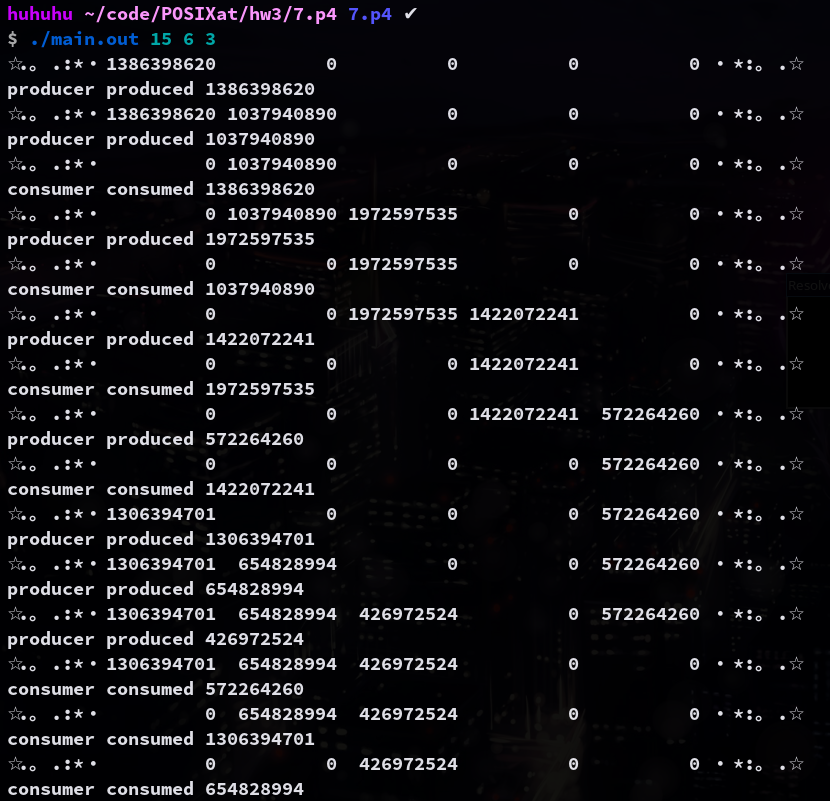

# 7.p4 The Producer– Consumer Problem

In this project, you will design a programming solution to the bounded-buffer problem using the producer and consumer processes shown in Figures 5.9 and 5.10. The solution presented in Section 7.1.1 uses three semaphores: empty and full, which count the number
of empty and full slots in the buffer, and mutex, which is a binary (or mutual-exclusion) semaphore that protects the actual nsertion or removal of items in the buffer. For this project, you will use standard counting semaphores for empty and full and a mutex lock, rather than a binary semaphore, to represent mutex. The producer and consumer—running as separate threads —will move items to and rom a buffer that is synchronized with the empty, full, and mutex structures.

### Compile

```sh
gcc main.c -o main.out -lpthread
```

### Usage

```sh
./main.out <sleep time> <producer threads> <consumer threads>
```

### Example Output

```sh
$ ./main.out 15 6 3
☆.。.:*・1386398620          0          0          0          0 ・*:。.☆
producer produced 1386398620
☆.。.:*・1386398620 1037940890          0          0          0 ・*:。.☆
producer produced 1037940890
☆.。.:*・         0 1037940890          0          0          0 ・*:。.☆
consumer consumed 1386398620
☆.。.:*・         0 1037940890 1972597535          0          0 ・*:。.☆
producer produced 1972597535
☆.。.:*・         0          0 1972597535          0          0 ・*:。.☆
consumer consumed 1037940890
☆.。.:*・         0          0 1972597535 1422072241          0 ・*:。.☆
producer produced 1422072241
☆.。.:*・         0          0          0 1422072241          0 ・*:。.☆
consumer consumed 1972597535
☆.。.:*・         0          0          0 1422072241  572264260 ・*:。.☆
producer produced 572264260
☆.。.:*・         0          0          0          0  572264260 ・*:。.☆
consumer consumed 1422072241
☆.。.:*・1306394701          0          0          0  572264260 ・*:。.☆
producer produced 1306394701
☆.。.:*・1306394701  654828994          0          0  572264260 ・*:。.☆
producer produced 654828994
☆.。.:*・1306394701  654828994  426972524          0  572264260 ・*:。.☆
producer produced 426972524
☆.。.:*・1306394701  654828994  426972524          0          0 ・*:。.☆
consumer consumed 572264260
☆.。.:*・         0  654828994  426972524          0          0 ・*:。.☆
consumer consumed 1306394701
☆.。.:*・         0          0  426972524          0          0 ・*:。.☆
consumer consumed 654828994
```

