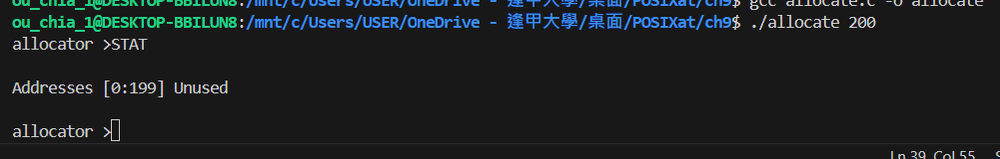
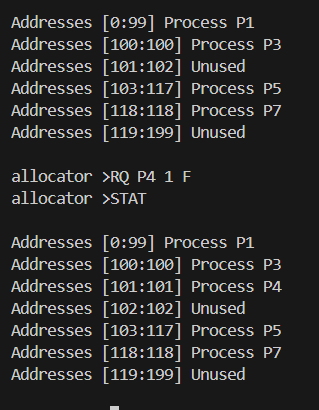
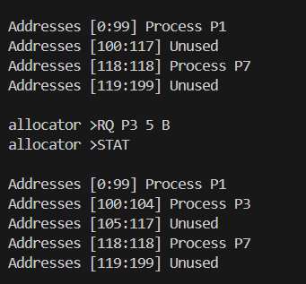
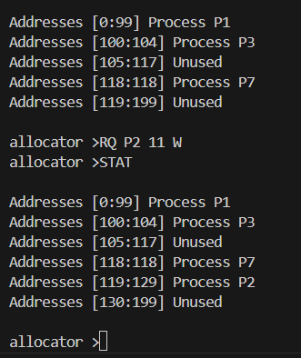
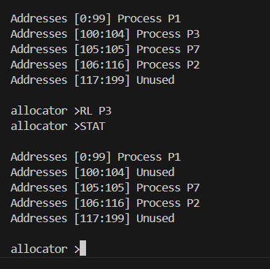
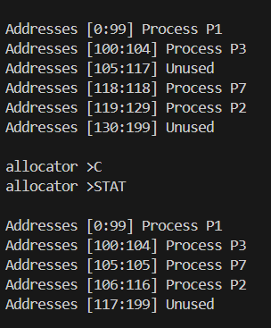
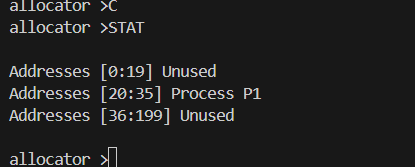
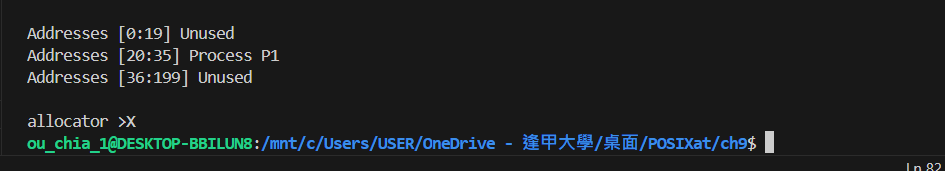

# project ch9

Programming Project for Ch.9\*: Contiguous Memory Allocation
In Section 9.2, we presented different algorithms for contiguous memory allocation.
This project will involve managing a contiguous region of memory of size MAX where addresses may range from 0 ... MAX− 1.
Your program must respond to four different requests:

1. Request for a contiguous block of memory
2. Release of a contiguous block of memory
3. Compact unused holes of memory into one single block
4. Report the regions of free and allocated memory

Your program will be passed the initial amount of memory at startup

compile

```
gcc allocate.c -o allocate
```

run

```
./allocate <init memory>
```



Once your program has started, it will present the user with the following
prompt:

```
allocator>
```

It will then respond to the following commands: RQ (request), RL (release), C
(compact), STAT (status report), and X (exit).
A request for 40,000 bytes will appear as follows:

```
allocator>RQ <process> <request memory number> <way>
```

- F — first fit

  

- B — best fit

  

- W — worst fit

  

The first parameter to the RQ command is the new process that requires the
memory, followed by the amount of memory being requested, and finally the
strategy. (In this situation, “W” refers to worst fit.)

```
allocator>RL <release process>
```



This command will release the memory that has been allocated to process P0.
The command for compaction is entered as:

```
allocator>C
```



This command will compact unused holes of memory into one region.
Finally, the STAT command for reporting the status of memory is entered
as:

```
allocator>STAT
```



exit

```
allocator>X
```


